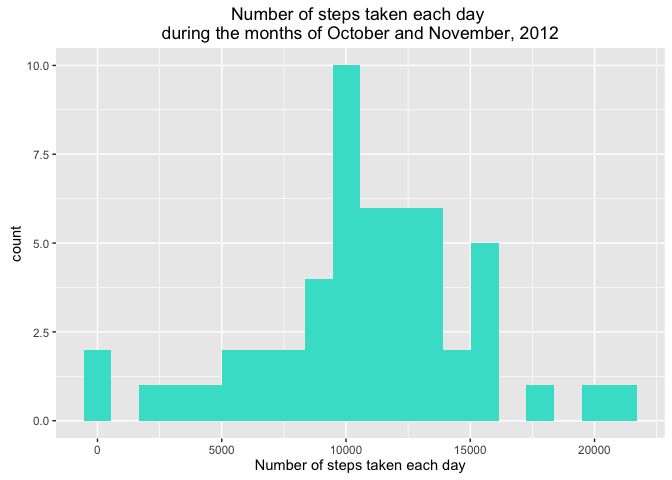
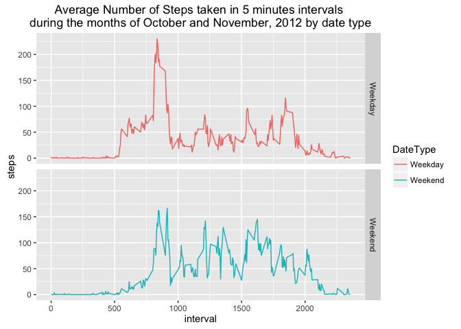

# Reproducible Research: Peer Assessment 1

This is the documentation report for the Reproducible Research course Peer 
Assessment 1. This assignment makes use of data from a personal activity 
monitoring device. This device collects data at 5 minute intervals through out 
the day.

## Loading and preprocessing the data


```r
if(!file.exists("activity.csv")){
    unzip("activity.zip",exdir = ".")
}
activityData <- read.csv("activity.csv",na.strings = "NA")
activityData$date <- as.Date(activityData$date)
```

## What is mean total number of steps taken per day?

1. Calculate the total number of steps taken per day

```r
totalStepsPerDay <- aggregate(steps~date, activityData, sum)
```

2. Histogram of the total number of steps taken each day

```r
library(ggplot2)
ggplot(totalStepsPerDay,aes(steps))+
    geom_histogram(bins = 20, fill = "turquoise") +
    ggtitle("Histogram of the total number of steps\ntaken each day")+
    xlab("Number of steps taken each day")
```



3. Calculate and report the mean and median of the total number of steps taken per day

```r
mean(totalStepsPerDay$steps)
```

```
## [1] 10766.19
```

```r
median(totalStepsPerDay$steps)
```

```
## [1] 10765
```


## What is the average daily activity pattern?

1. Time series plot of the 5-minute interval (x-axis) and the average number of 
steps taken, averaged across all days (y-axis)

```r
averageNumberSteps <- aggregate(steps~interval, activityData, mean)

ggplot(averageNumberSteps,aes(interval,steps))+
    geom_line(col="dodgerblue") + 
    labs(title = "Average Number of Steps Taken\nAcross All Days")+
    xlab("5-min Interval")+
    ylab("Avg. Steps Across All Days")
```


2. Which 5-minute interval, on average across all the days in the dataset, contains the maximum number of steps?

```r
subset(averageNumberSteps,steps == max(averageNumberSteps$steps,na.rm = TRUE))
```

```
##     interval    steps
## 104      835 206.1698
```


## Imputing missing values

1. Calculate and report the total number of missing values in the dataset (i.e. 
the total number of rows with NA's)


```r
sum(is.na(activityData$steps))
```

```
## [1] 2304
```

2. Devise a strategy for filling in all of the missing values in the dataset. 
The strategy does not need to be sophisticated. For example, you could use the 
mean/median for that day, or the mean for that 5-minute interval, etc.

```r
filledMissingNA <- merge(activityData,averageNumberSteps, by = "interval")
filledMissingNA$steps <- ifelse(is.na(filledMissingNA$steps.x),
                                filledMissingNA$steps.y,
                                filledMissingNA$steps.x)
filledMissingNA <- subset(filledMissingNA, select = c(interval,steps,date))
```

3. Make a histogram of the total number of steps taken each day and Calculate
and report the mean and median total number of steps taken per day. Do these 
values differ from the estimates from the first part of the assignment? What is
the impact of imputing missing data on the estimates of the total daily number 
of steps?

```r
totalStepsPerDayNoNA <- aggregate(steps~date, filledMissingNA, sum)
ggplot(totalStepsPerDayNoNA,aes(steps))+
    geom_histogram(bins = 20, fill = "indianred1") +
    ggtitle("Histogram of the total number of steps\ntaken each day")+
    xlab("Number of steps taken each day")
```


```r
mean(totalStepsPerDayNoNA$steps)
```

```
## [1] 10766.19
```

```r
median(totalStepsPerDayNoNA$steps)
```

```
## [1] 10766.19
```


## Are there differences in activity patterns between weekdays and weekends?

1. Create a new factor variable in the dataset with two levels – “weekday” and
“weekend” indicating whether a given date is a weekday or weekend day.

```r
filledMissingNA$DateType <- ifelse(weekdays(filledMissingNA$date)=="Sunday"|
                                       weekdays(filledMissingNA$date)=="Saturday",
                                   "Weekend","Weekday")
filledMissingNA$DateType <- as.factor(filledMissingNA$DateType )
```

2. Make a panel plot containing a time series plot of the 5-minute interval 
(x-axis) and the average number of steps taken, averaged across all weekday 
days or weekend days (y-axis). 

```r
averageNumberStepsNoNA <- aggregate(steps~interval+DateType, filledMissingNA, mean)
qplot(interval,steps,data=averageNumberStepsNoNA,facets = DateType~.,geom = "line",
      col=DateType)
```




